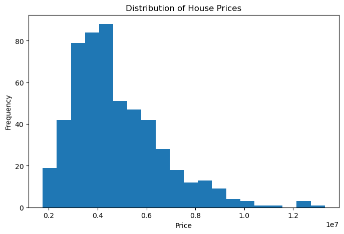
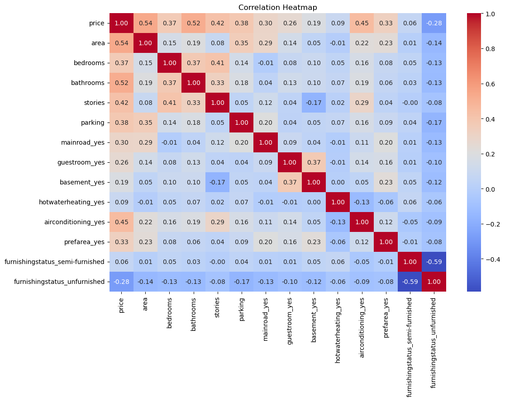
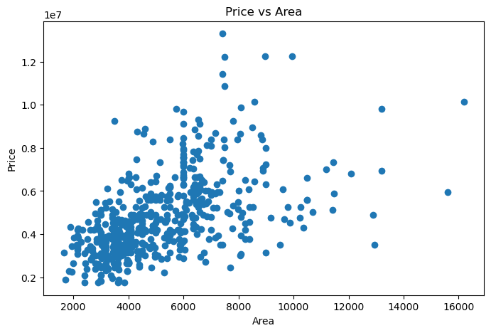

```python
#Task 1 — Data Loading & Exploration
import pandas as pd
df = pd.read_csv("Housing.csv")
print("First 10 Rows:")
print(df.head(10))
print("\nShape of Dataset:")
print(df.shape)
print("\nRows:", df.shape[0])
print("Columns:", df.shape[1])
print("\nColumns in Dataset:")
print(df.columns)
target = "price"   
features = df.columns.drop("price")
print("\nTarget Column:")
print(target)
print("\nFeature Columns:")
print(list(features))
print("\nMissing Values in Each Column:")
print(df.isnull().sum())
```

    First 10 Rows:
          price   area  bedrooms  bathrooms  stories mainroad guestroom basement  \
    0  13300000   7420         4          2        3      yes        no       no   
    1  12250000   8960         4          4        4      yes        no       no   
    2  12250000   9960         3          2        2      yes        no      yes   
    3  12215000   7500         4          2        2      yes        no      yes   
    4  11410000   7420         4          1        2      yes       yes      yes   
    5  10850000   7500         3          3        1      yes        no      yes   
    6  10150000   8580         4          3        4      yes        no       no   
    7  10150000  16200         5          3        2      yes        no       no   
    8   9870000   8100         4          1        2      yes       yes      yes   
    9   9800000   5750         3          2        4      yes       yes       no   
    
      hotwaterheating airconditioning  parking prefarea furnishingstatus  
    0              no             yes        2      yes        furnished  
    1              no             yes        3       no        furnished  
    2              no              no        2      yes   semi-furnished  
    3              no             yes        3      yes        furnished  
    4              no             yes        2       no        furnished  
    5              no             yes        2      yes   semi-furnished  
    6              no             yes        2      yes   semi-furnished  
    7              no              no        0       no      unfurnished  
    8              no             yes        2      yes        furnished  
    9              no             yes        1      yes      unfurnished  
    
    Shape of Dataset:
    (545, 13)
    
    Rows: 545
    Columns: 13
    
    Columns in Dataset:
    Index(['price', 'area', 'bedrooms', 'bathrooms', 'stories', 'mainroad',
           'guestroom', 'basement', 'hotwaterheating', 'airconditioning',
           'parking', 'prefarea', 'furnishingstatus'],
          dtype='object')
    
    Target Column:
    price
    
    Feature Columns:
    ['area', 'bedrooms', 'bathrooms', 'stories', 'mainroad', 'guestroom', 'basement', 'hotwaterheating', 'airconditioning', 'parking', 'prefarea', 'furnishingstatus']
    
    Missing Values in Each Column:
    price               0
    area                0
    bedrooms            0
    bathrooms           0
    stories             0
    mainroad            0
    guestroom           0
    basement            0
    hotwaterheating     0
    airconditioning     0
    parking             0
    prefarea            0
    furnishingstatus    0
    dtype: int64
    


```python
#Task 2 — Data Cleaning
print("Missing Values:")
print(df.isnull().sum())
print("\nDuplicate Rows:", df.duplicated().sum())
df = df.drop_duplicates()
print("Shape after removing duplicates:", df.shape)
df = pd.get_dummies(df, drop_first=True)
print("\nDataset after Encoding:")
print(df.head())
X = df.drop('price', axis=1)  
y = df['price']               
print("\nFeatures Shape:", X.shape)
print("Target Shape:", y.shape)
```

    Missing Values:
    price                              0
    area                               0
    bedrooms                           0
    bathrooms                          0
    stories                            0
    parking                            0
    mainroad_yes                       0
    guestroom_yes                      0
    basement_yes                       0
    hotwaterheating_yes                0
    airconditioning_yes                0
    prefarea_yes                       0
    furnishingstatus_semi-furnished    0
    furnishingstatus_unfurnished       0
    dtype: int64
    
    Duplicate Rows: 0
    Shape after removing duplicates: (545, 14)
    
    Dataset after Encoding:
          price  area  bedrooms  bathrooms  stories  parking  mainroad_yes  \
    0  13300000  7420         4          2        3        2          True   
    1  12250000  8960         4          4        4        3          True   
    2  12250000  9960         3          2        2        2          True   
    3  12215000  7500         4          2        2        3          True   
    4  11410000  7420         4          1        2        2          True   
    
       guestroom_yes  basement_yes  hotwaterheating_yes  airconditioning_yes  \
    0          False         False                False                 True   
    1          False         False                False                 True   
    2          False          True                False                False   
    3          False          True                False                 True   
    4           True          True                False                 True   
    
       prefarea_yes  furnishingstatus_semi-furnished  furnishingstatus_unfurnished  
    0          True                            False                         False  
    1         False                            False                         False  
    2          True                             True                         False  
    3          True                            False                         False  
    4         False                            False                         False  
    
    Features Shape: (545, 13)
    Target Shape: (545,)
    


```python
#Task 3 — Model Building
import pandas as pd
from sklearn.model_selection import train_test_split
from sklearn.linear_model import LinearRegression
from sklearn.ensemble import RandomForestRegressor
from sklearn.metrics import mean_absolute_error, mean_squared_error, r2_score
import numpy as np
df = pd.read_csv("Housing.csv")
df = pd.get_dummies(df, drop_first=True)
X = df.drop('price', axis=1)
y = df['price']
X_train, X_test, y_train, y_test = train_test_split(
    X, y, test_size=0.2, random_state=42
)
lr = LinearRegression()
lr.fit(X_train, y_train)
y_pred_lr = lr.predict(X_test)
print("Linear Regression")
print("MAE :", mean_absolute_error(y_test, y_pred_lr))
print("RMSE:", np.sqrt(mean_squared_error(y_test, y_pred_lr)))
print("R2 Score:", r2_score(y_test, y_pred_lr))
rf = RandomForestRegressor(random_state=42)
rf.fit(X_train, y_train)
y_pred_rf = rf.predict(X_test)
print("\nRandom Forest")
print("MAE :", mean_absolute_error(y_test, y_pred_rf))
print("RMSE:", np.sqrt(mean_squared_error(y_test, y_pred_rf)))
print("R2 Score:", r2_score(y_test, y_pred_rf))
```

    Linear Regression
    MAE : 970043.4039201641
    RMSE: 1324506.9600914388
    R2 Score: 0.6529242642153182
    
    Random Forest
    MAE : 1021546.0353211008
    RMSE: 1400565.9728553821
    R2 Score: 0.611918531405699
    


```python
#Task 4 — Visualization (Minimum 3 charts)
import pandas as pd
import matplotlib.pyplot as plt
import seaborn as sns
df = pd.read_csv("Housing.csv")
#chart 1 - Histogram
plt.figure(figsize=(8,5))
plt.hist(df['price'], bins=20)
plt.title("Distribution of House Prices")
plt.xlabel("Price")
plt.ylabel("Frequency")
plt.show()
#chart 2 - Heatmap
df_encoded = pd.get_dummies(df, drop_first=True)
plt.figure(figsize=(12,8))
sns.heatmap(df_encoded.corr(),
            annot=True,
            cmap='coolwarm',
            fmt='.2f')

plt.title("Correlation Heatmap")
plt.show()
#chart 3 - Scatter Plot
plt.figure(figsize=(8,5))
plt.scatter(df['area'], df['price'])
plt.title("Price vs Area")
plt.xlabel("Area")
plt.ylabel("Price")
plt.show()
```


    

    


    

    


    

    


```python
#Task 5 — Insights & Summary
#conclusion
After analyzing the housing dataset, I found that factors such as area, number of bathrooms, bedrooms, and other amenities had a significant impact on house prices. The model performed reasonably well in predicting house prices, indicating that these features are useful for estimating property values. One thing that surprised me was that some houses with a similar number of bedrooms had very different prices, showing that other factors like area and facilities also play an important role. The correlation analysis revealed that larger houses generally tend to have higher prices. Based on these findings, I would recommend that real estate businesses focus on properties with larger living spaces and modern amenities, as these features are more likely to increase property value and attract potential buyers.

```
